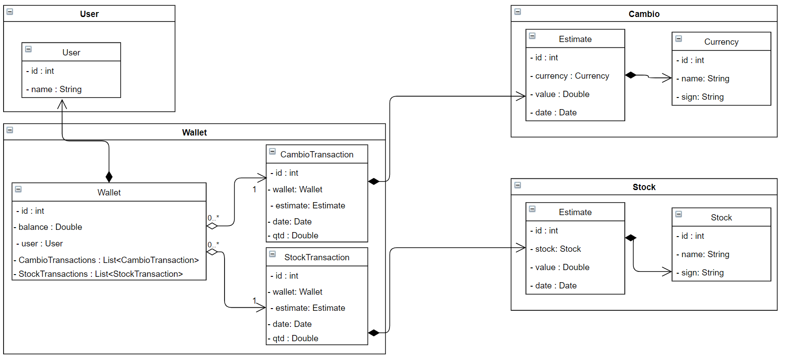
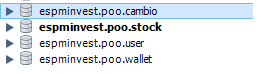
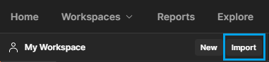

# Espminvest - Microservices project for OOP class.

A Spring Boot project with microservice architecture folowing OOP principles. 

Professor : [Humberto Sandman](https://github.com/hsandmann)

## Links

### Microservices

[Wallet](https://github.com/PedroMiotti/espminvest.poo.wallet) - Wallet microservice responsible for coordinating transactions.  
[Cambio microservice](https://github.com/PedroMiotti/espminvest.poo.cambio) - Cambio microservice responsible for providing the details of currency exchange.  
[Stock microservice](https://github.com/PedroMiotti/espminvest.poo.stock) - Stock microservice responsible for providing the details of stock exchange.  
[User microservice](https://github.com/PedroMiotti/espminvest.poo.user) - Stock microservice responsible for providing the user details.  
[Eureka microservice](https://github.com/PedroMiotti/espminvest.poo.eureka) - Service discovery microservice  

### Common packages

[Wallet Common module](https://github.com/PedroMiotti/espminvest.poo.wallet.common) - Provides wallet reusable datatypes and a controller interface   
[Cambio Common module](https://github.com/PedroMiotti/espminvest.poo.cambio.common) - Provides cambio reusable datatypes and a controller interface  
[Stock Common module](https://github.com/PedroMiotti/espminvest.poo.stock.common) - Provides stock reusable datatypes and a controller interface  
[User Common module](https://github.com/PedroMiotti/espminvest.poo.user.common) - Provides user reusable datatypes and a controller interface  

## UML diagram

## Database Tables

## Testing 

If you want to test the endpoints, just download the `espminvest.poo.postman_colection.json` file inside the /.github folder, and import it into postman, all the routes are already pre-configured.

